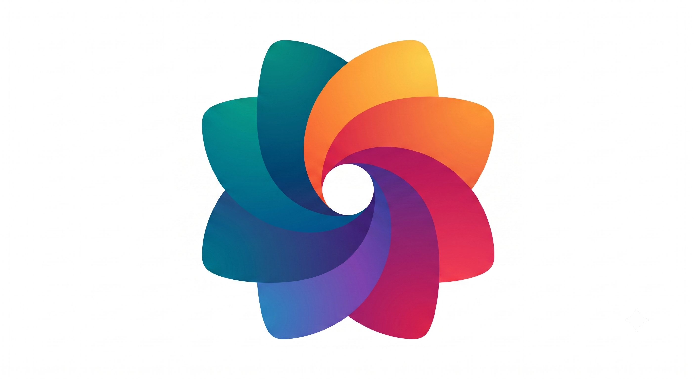

# PhotoRelay

  

[中文版 (Chinese Version)](README_zh.md)

**PhotoRelay** is a bridge application born out of a very specific photo backup workflow.

## The Story Behind It

I have a Google Pixel 3, which is grandfathered into **unlimited original-quality Google Photos backup**. However, my primary daily driver is an iPhone, where all my photos are actually taken and stored. Additionally, I use a self-hosted [Immich](https://immich.app/) server as my primary hot storage and secondary backup solution. 

My goal was to create an automated, effortless pipeline to flow my photos from my iPhone to my final destination in Google Photos via the Pixel 3.

**The Workflow:**
`iPhone` ➔ `Immich Server` ➔ **`[PhotoRelay on Pixel 3]`** ➔ `Google Photos`

PhotoRelay sits on the Pixel 3. It runs quietly in the background, automatically syncing and downloading new photos from my Immich server straight to the Pixel's local storage. From there, the Pixel 3's native Google Photos app takes over and uploads everything to the cloud in original quality for free.

## What It Does
- **Automated Sync:** Periodically pulls new photos from Immich in the background without user intervention.
- **Set it and Forget it:** Runs seamlessly on an old Pixel device left plugged in at home.
- **Auto Cleanup:** Keeps the Pixel's storage from filling up by automatically removing old synced photos after they've been safely backed up to Google.

It's essentially a missing puzzle piece for anyone utilizing an old Pixel for unlimited Google Photos backups in tandem with a self-hosted Immich instance!
